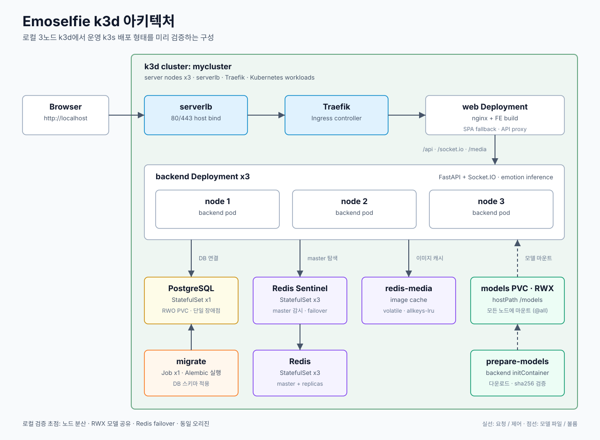
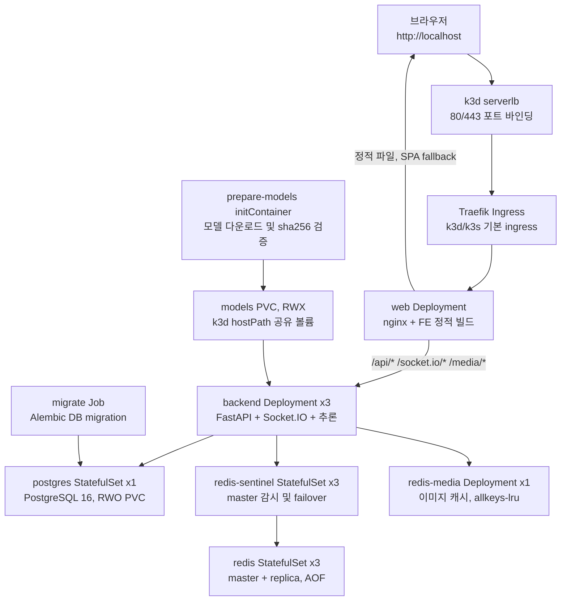

# Emoselfie k3d 아키텍처

**상태** 초안  
**기준일** 2026-09-11  
**범위** 로컬 k3d 3노드 클러스터에서 `emoselfie` 전체 스택을 실행하는 구성

이 문서는 k3d에서 Emoselfie를 어떻게 띄우는지 한눈에 파악하기 위한 아키텍처 문서다. 세부 운영 절차와 검증 기록은 `emoselfie-INFRA/k8s/README.md`를 기준으로 한다.

## 전체 구성도





## 구성 목표

k3d 구성은 로컬 개발 환경이지만, 단순한 단일 컨테이너 실행이 아니라 운영 예정인 EC2 k3s 구성을 최대한 닮게 만든다.

- k3d 서버 노드 3개를 사용해 backend replica 3개가 노드별로 분산되는지 확인한다.
- backend는 `requests == limits`로 1 CPU, 2Gi 메모리를 고정해 운영 인스턴스의 스케줄 가능성을 로컬에서 검증한다.
- FE와 BE는 nginx를 통해 동일 오리진으로 묶는다.
- Redis는 Sentinel 기반 failover를 검증한다.
- 모델 파일은 이미지에 넣지 않고 공유 볼륨에 준비한다.

## 요청 흐름

브라우저 요청은 다음 순서로 이동한다.

1. 브라우저가 `http://localhost`로 접속한다.
2. k3d `serverlb`가 호스트의 80/443 포트를 클러스터 안으로 전달한다.
3. Traefik Ingress가 `/` 요청을 `web` Service로 보낸다.
4. `web` pod의 nginx가 FE 정적 파일을 서빙한다.
5. nginx가 `/api/*`, `/socket.io/*`, `/media/*` 요청을 `backend` Service로 프록시한다.
6. backend는 PostgreSQL, Redis Sentinel, redis-media, models PVC를 사용해 게임 상태, 실시간 이벤트, 이미지 캐시, 추론 모델을 처리한다.

nginx를 앞에 두는 이유는 SameSite 쿠키와 브라우저 보안 정책 때문이다. FE와 BE가 다른 오리진으로 분리되면 쿠키 기반 참가자 식별과 Socket.IO 연결이 깨질 수 있으므로, 로컬 k3d에서도 하나의 오리진으로 동작하게 한다.

## Kubernetes 객체

| 계층 | 객체 | 역할 |
|---|---|---|
| Ingress | `Ingress/emoselfie` | Traefik을 통해 외부 요청을 `web` Service로 전달 |
| Web | `Deployment/web`, `Service/web` | nginx로 FE 정적 빌드 서빙, API와 Socket.IO 프록시 |
| Backend | `Deployment/backend`, `Service/backend` | FastAPI, Socket.IO, 감정 추론 실행 |
| Migration | `Job/migrate` | 배포 시 Alembic 마이그레이션 1회 실행 |
| Database | `StatefulSet/postgres`, `Service/postgres` | PostgreSQL 단일 인스턴스와 RWO PVC |
| Realtime | `StatefulSet/redis`, `StatefulSet/redis-sentinel` | Redis master/replica와 Sentinel failover |
| Media Cache | `Deployment/redis-media`, `Service/redis-media` | 결과 이미지 캐시. 유실 허용 |
| Model Storage | `PVC/models`, `PV/models-k3d-hostpath` | 세 노드 backend가 공유하는 모델 파일 저장소 |
| Config | `ConfigMap/backend-env`, `ConfigMap/nginx-conf`, `Secret/emoselfie-secrets` | 런타임 설정, nginx 설정, 로컬 개발용 secret |

## 노드와 스토리지

로컬 클러스터는 서버 노드 3개를 사용한다.

```bash
k3d cluster create mycluster --servers 3 \
  --servers-memory 4g \
  --volume "$HOME/.emoselfie-models:/models@all" \
  -p "80:80@loadbalancer" \
  -p "443:443@loadbalancer"
```

`--servers-memory 4g`는 각 k3d 노드의 메모리를 EC2 `t3.medium`과 비슷하게 맞추기 위한 설정이다. backend pod가 2Gi를 요청하므로 3개 replica가 각 노드에 하나씩 들어가는지 확인할 수 있다.

모델 PVC는 `ReadWriteMany`가 필요하다. k3d에서는 세 노드가 같은 Docker 호스트 위의 컨테이너이므로, 호스트 디렉터리 하나를 `--volume ...@all`로 모든 노드에 마운트해 공유 볼륨처럼 사용한다. 운영 k3s에서는 같은 역할을 Longhorn이 맡는다.

## 모델 준비 흐름

backend 이미지는 모델 가중치를 포함하지 않는다. 대신 backend pod가 시작될 때 `prepare-models` initContainer가 먼저 실행된다.

1. `emoselfie-models` 이미지가 `/models` 볼륨에 모델 파일을 내려받는다.
2. 이미 파일이 있으면 sha256을 검증하고 다운로드를 건너뛴다.
3. initContainer가 성공하면 backend 컨테이너가 같은 볼륨을 읽기 전용으로 마운트한다.

이 방식은 이미지 크기를 줄이고, replica 3개가 같은 모델 파일을 재사용하게 한다.

## 데이터 저장소

PostgreSQL은 단일 StatefulSet이다. 현재 구성에서 가장 중요한 단일 장애점이다. PVC가 `ReadWriteOnce`이고 k3s 기본 `local-path` 스토리지에 묶이므로, 해당 노드 장애 시 다른 노드로 자동 failover되지 않는다.

Redis는 세 pod와 Sentinel 세 pod로 구성한다. backend는 `redis+sentinel://.../mymaster` 형식으로 Sentinel에 현재 master를 물어본다. Redis master pod가 죽으면 Sentinel이 replica를 승격하고, backend는 재시작 없이 새 master에 쓸 수 있다.

`redis-media`는 결과 이미지 캐시 전용이다. 점수나 방 상태의 원본 데이터가 아니므로 복제와 영속화를 하지 않고, `allkeys-lru` 정책으로 메모리를 제한한다.

## 로컬과 운영 차이

| 항목 | 로컬 k3d | 운영 EC2 k3s |
|---|---|---|
| 노드 | Docker 컨테이너 기반 k3d server 3개 | EC2 인스턴스 3대 |
| CPU 아키텍처 | Apple Silicon이면 arm64 네이티브 | amd64 |
| Ingress | k3d serverlb + Traefik | ALB 또는 Cloudflare 등 앞단 + Traefik |
| 모델 RWX | hostPath를 모든 k3d 노드에 마운트 | Longhorn RWX 볼륨 |
| Secret | overlay local의 개발용 `secretGenerator` | 클러스터에 직접 생성 |
| Postgres | 단일 인스턴스 | 현재는 단일 인스턴스. HA 필요 시 CloudNativePG 검토 |

## 배포 절차 요약

```bash
docker build -t emoselfie-backend:local ../emoselfie-BE
docker build --target models -t emoselfie-models:local ../emoselfie-BE
docker build -t emoselfie-web:local ../emoselfie-FE

k3d image import emoselfie-backend:local emoselfie-models:local emoselfie-web:local -c mycluster

kubectl create namespace local --dry-run=client -o yaml | kubectl apply -f -
kubectl delete job migrate -n local --ignore-not-found
kubectl apply -k k8s/overlays/local
```

## 검증 포인트

- `kubectl get nodes`에서 server 노드 3개가 Ready인지 확인한다.
- `kubectl get pods -o wide -n local`에서 backend pod 3개가 서로 다른 노드에 분산됐는지 확인한다.
- `kubectl logs -n local deploy/backend -c prepare-models` 또는 각 backend pod 로그에서 모델이 최초 다운로드 후 재사용되는지 확인한다.
- `kubectl get statefulset -n local redis redis-sentinel postgres`로 상태 저장 계층이 준비됐는지 확인한다.
- `http://localhost`에서 방 생성, 입장, Socket.IO 연결, 이미지 제출이 동작하는지 브라우저로 확인한다.

## 알려진 한계와 후속 과제

- PostgreSQL은 HA가 아니다. 운영에서 DB 장애 대응이 필요하면 CloudNativePG 같은 오퍼레이터 도입이 필요하다.
- Redis pub/sub은 failover 순간 일부 이벤트를 잃을 수 있다. 라운드 상태 재동기화 경로가 있어야 사용자 화면이 멈추지 않는다.
- backend replica가 2개 이상이면 Socket.IO polling 핸드셰이크 때문에 sticky session이 필요하다. 운영 overlay의 Service affinity 설정을 확인해야 한다.
- TLS를 Traefik 앞단에서 종료하면 `X-Forwarded-Proto` 전달이 중요하다. 브라우저의 same-origin 검사와 WebSocket 업그레이드는 curl 테스트만으로 충분히 검증되지 않는다.
